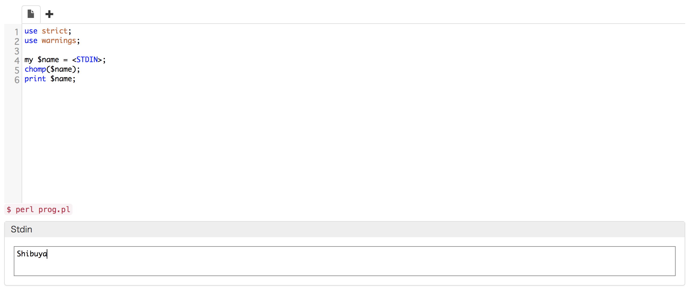

# 回答例

## 練習問題 2-1

> あなたの名前やIDのアルファベット表記をスカラー変数に格納し, スカラー変数に格納した文字列を`print`関数で出力するコードを書いてみましょう

### 例

```perl
use strict;
use warnings;

my $name = "Shibuya";
print $name;
```

### 出力

```
Shibuya
```

## 練習問題 2-2

> 標準入力であなたの名前やIDを入力して, その文字列を`print`関数で出力するコードを書いてみましょう

### 例

```perl
use strict;
use warnings;

my $name = <STDIN>;
chomp($name);
print $name;
```

### 入力

```
Shibuya
```



### 出力

```
Shibuya
```

## 練習問題 2-3

> 標準入力から0以外の整数を2つ読み込み, それらを四則演算(`+`, `-`, `*`. `/`)した結果を出力するコードを書いてみましょう

### 例

```perl
use strict;
use warnings;

my $left = <STDIN>;
chomp($left);

my $right = <STDIN>;
chomp($right);

my $sum = $left + $right;
my $sub = $left - $right;
my $mul = $left * $right;
my $div = $left / $right;

print "$left + $right = $sum\n";
print "$left - $right = $sub\n";
print "$left * $right = $mul\n";
print "$left / $right = $div\n";
```

### 入力

```
1
2
```

### 出力

```
1 + 2 = 3
1 - 2 = -1
1 * 2 = 2
1 / 2 = 0.5
```
