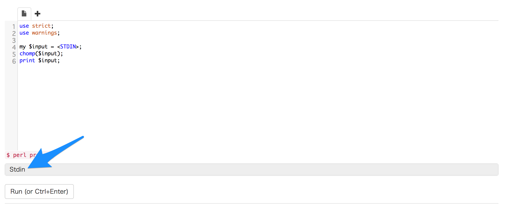

# 標準入力

## Perlへ文字を入力する

これまで, Perlの組み込み関数`print`を使いながら, Perlからデータを出力する方法を学んできました. ここでは, Perlに対して逆に文字列を入力する方法の1つ, ｢標準入力｣について学びます.

```perl
use strict;
use warnings;

my $input = <STDIN>;
chomp($input);
print $input;
```

これは, 標準入力を利用したPerlのコードの例です.
Perlにおいては, 標準入力は`<STDIN>`で表され, この結果をスカラー変数`$input`に代入しています.

ここで, `chomp`という関数が出てきました.
これも`print`と同じくPerlの組み込み関数の1つで, ｢文字列の末尾にある改行を除去する｣という効果を持つ関数です.
標準入力を利用して受け取った文字列には, 末尾に改行文字が入っているので, `chomp`関数を使って取り除いています.

## Wandbox上で標準入力を使う

Wandbox上で標準入力を利用する方法について解説します.
コードを入力するテキストボックス(エディタ)の下に, ｢Stdin｣と書かれた部分があります(青矢印).



ここがWandboxでコードを実行する際の, 標準入力を指定する部分です.
このテキストエリアに入力された文字列が, エディタに書かれたコードをWandboxが実行する際の標準入力として与えられます.
ここでは, ｢sample string｣という文字列を指定しています.


この状態で, コードを実行した結果が次の通りです. ｢Stdin｣で指定した, ｢sample string｣という文字列が出力されていることがわかります.


## 練習問題 2-2

標準入力であなたの名前やIDを入力して, その文字列を`print`関数で出力するコードを書いてみましょう
